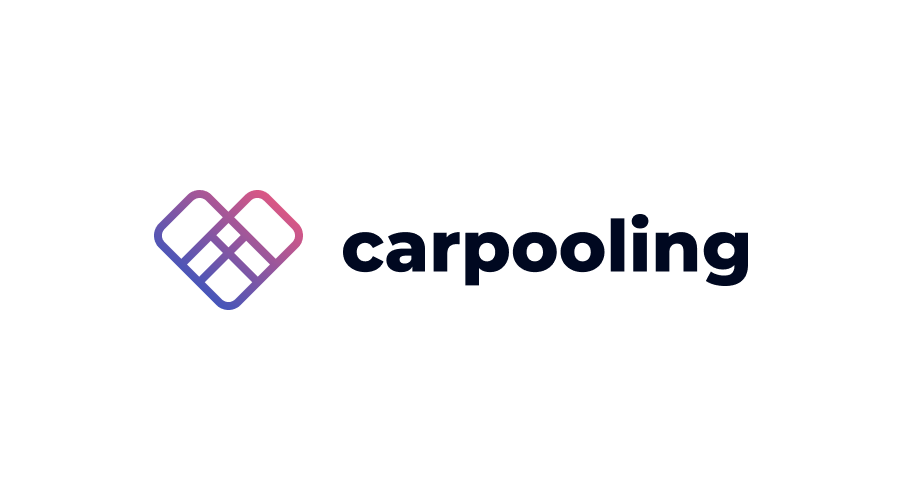
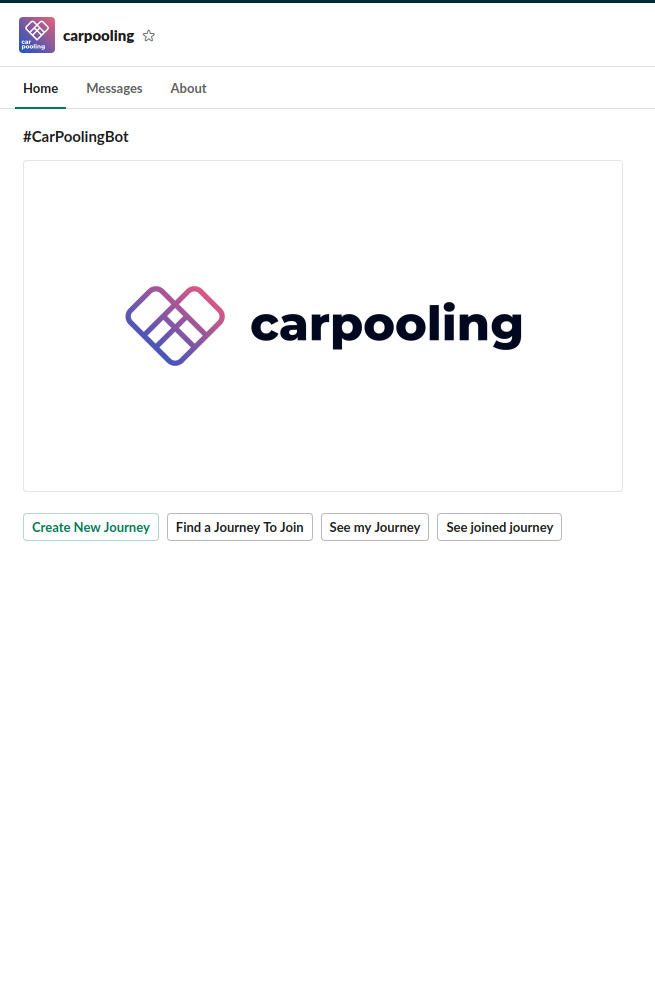
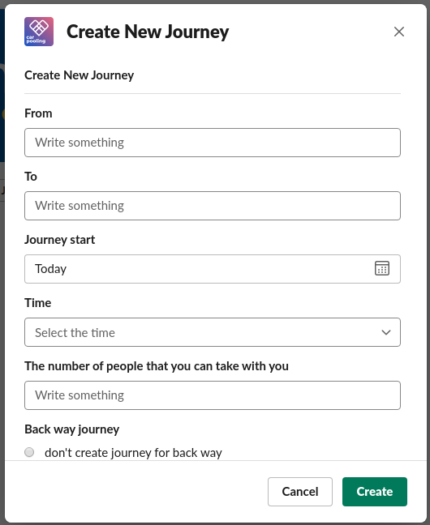
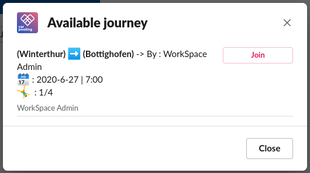
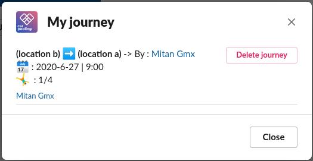
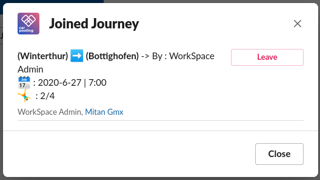
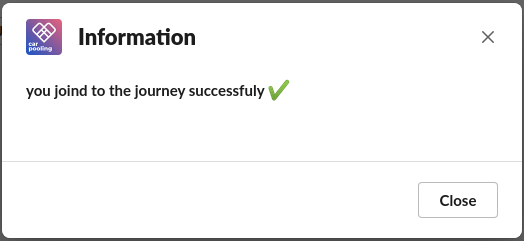

# Car Pooling Slack Bot


## Intro
this app is built to make Business Travels Carpooling much easier. <br>
it's built with Interactivity user interface <br>
it allow people to create journeys and allow the others to join or leave the journey, with real time notification via bot message tab in slack about joins and leaves actions and giving the journey creator to manage his journeys

## Installation

* Create a mysql database
* Run sql command that's exist in file [carpooling_bot.sql](./carpooling_bot.sql)
* Create slack bot [New Slack Bot](https://api.slack.com/apps?new_app=1)
* After creating the boot you will access the bot settings, under `Features` you will see `App Home` click it
* There is a section in the page called `Show Tabs`, enable `Home Tab` & `Messages Tab`
* Then open `OAuth & Permissions` and copy `Bot User OAuth Access Token`
* Paste the access token in file [slack_token.js](./includes/slack_token.js) file
* Open `Basic information` Page and copy `Signing Secret` and paste it alos to [slack_token.js](./includes/slack_token.js) file
* upload the file to your server and run `npm i`

now the server side is ready to run
run the application with environment
```bash
    SLACK_SIGNING_SECRET='slack_signing_secret' \
    SLACK_BOT_TOKEN='slack_bot_token' \
    DB_HOST='your_db_host' \
    DB_USER='your_db_user' \
    DB_PASS="your_db_pass" \
    DB_NAME='your_db_name' \
    DB_PORT=your_db_port_as_number \
    node app.js
```

* Copy the url of your server and go again the slack setting
* open `Event Subscriptions` page and enable events
* Set the request url to `www.my_bot_domain.com/events`
* In `Subscribe to bot events` subscribe in 
    * app_home_opened
    * message.im
* open `Interactivity & Shortcuts` page and enable Interactivity
* Set the request url to `www.my_bot_domain.com/actions`
* In `OAuth & Permissions` page there is section called `Bot Token Scopes`, ask for this scopes
    * chat:write
    * im:history
    * team:read
    * users:profile:read
    * users:read
    * users:read:email

## screenshots






